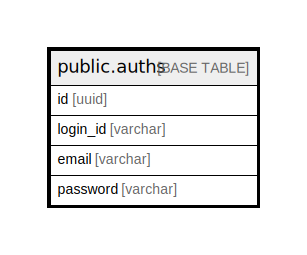

# public.auths

## Description

## Columns

| Name | Type | Default | Nullable | Children | Parents | Comment |
| ---- | ---- | ------- | -------- | -------- | ------- | ------- |
| id | uuid |  | false |  |  |  |
| login_id | varchar |  | false |  |  |  |
| email | varchar |  | false |  |  |  |
| password | varchar |  | false |  |  |  |

## Constraints

| Name | Type | Definition |
| ---- | ---- | ---------- |
| auths_pkey | PRIMARY KEY | PRIMARY KEY (id) |

## Indexes

| Name | Definition |
| ---- | ---------- |
| auths_pkey | CREATE UNIQUE INDEX auths_pkey ON public.auths USING btree (id) |
| auths_login_id_key | CREATE UNIQUE INDEX auths_login_id_key ON public.auths USING btree (login_id) |
| auths_email_key | CREATE UNIQUE INDEX auths_email_key ON public.auths USING btree (email) |
| login_id_index | CREATE UNIQUE INDEX login_id_index ON public.auths USING btree (login_id) |

## Relations

---

> Generated by [tbls](https://github.com/k1LoW/tbls)
